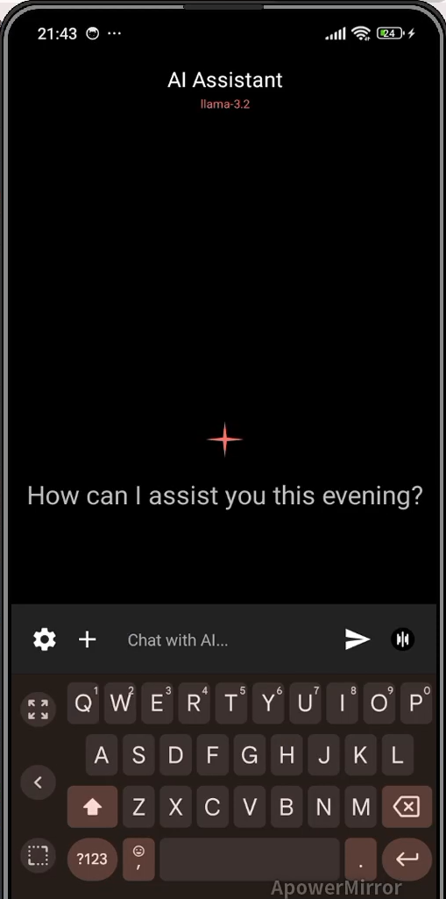
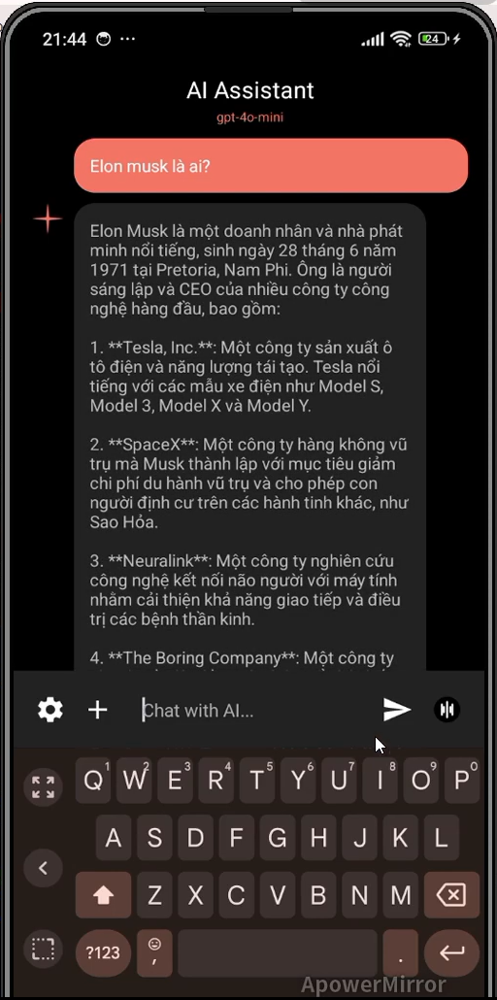
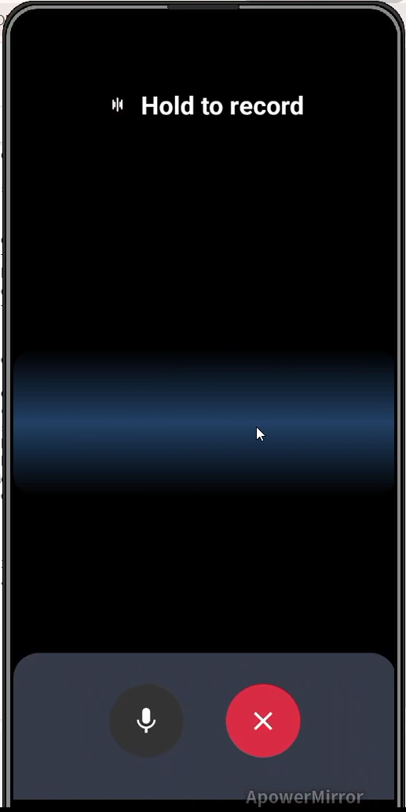
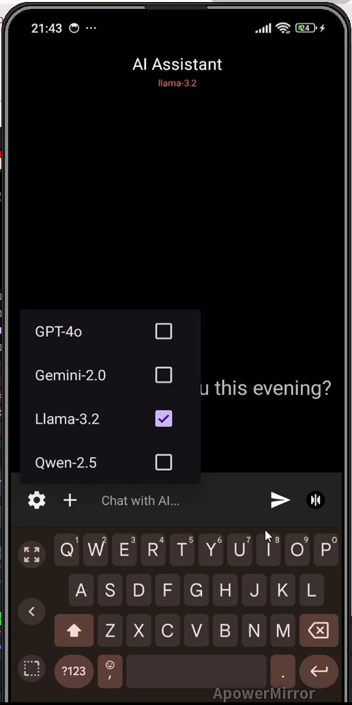
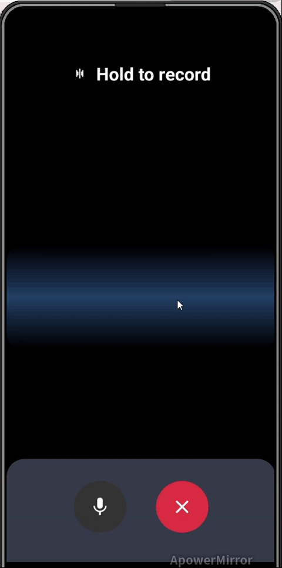

# AI Voice Assistant

AI Voice Assistant is an Android application that allows users to interact with powerful AI models through chat interface and voice interactions.

## Key Features

- Text chat with various AI models
- Voice interaction (press and hold to record)
- Text-to-speech conversion
- Support for multiple AI models:
  - OpenAI GPT-4o-mini
  - Google Gemini 2.0
  - Llama 3.2
  - Qwen 2.5

## Technologies Used

- **Language**: Java
- **Framework**: Android SDK
- **API Connection Libraries**:
  - Retrofit2 and OkHttp for network requests
  - Gson for JSON processing
- **AI APIs**:
  - OpenAI API (Chat Completion and Speech-to-Text)
  - Google Gemini API
  - Llama and Qwen models (via custom API)
- **UI Libraries**:
  - RecyclerView for message display
  - Material Design Components

## App Interface

### Main Screen

### Chat Screen

### Voice Interaction

### Settings

### Voice Chat Demo

## How to Use

1. **Text Chat**:
   - Enter a message in the text field
   - Press the send button to send the message to AI
   - View AI's response displayed in the conversation history

2. **Voice Interaction**:
   - Press the microphone button
   - Hold the button to record your voice
   - Release the button to send the audio to AI for processing
   - AI will convert speech to text, process it, and respond with voice

3. **Change AI Model**:
   - Press the settings button
   - Select the desired AI model from the menu

4. **Create a New Conversation**:
   - Press the "New Conversation" button to clear history and start a new conversation

## System Requirements

- Android 8.0 (API 24) or higher
- Internet connection
- Microphone access permission (for voice recognition feature)

## Development

This project uses Gradle to manage dependencies. For development, you need to:

1. Clone the repository
2. Open the project in Android Studio
3. Make sure you have the necessary API keys in the Constants.java file
4. Build and run the application

## License

© 2024 - Copyright belongs to the author 